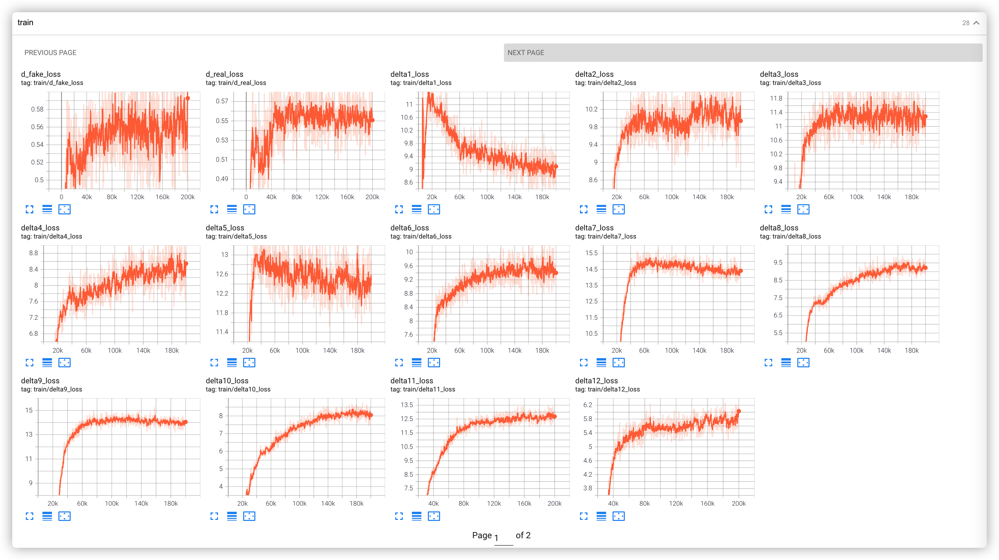

# encoder4editing with MobileNetV3
  </a>
  <a href="https://opensource.org/licenses/MIT"></a>
  <a href="https://github.com/omertov/encoder4editing"></a>


<p align="center">

<br>
The demo of different styles images of e4e-mbv3 framework.</p>

## Description  

Re-implementation of e4e that use mobilenet-v3 and stylegan2-1024p. Then mix different styles by stylegan2 and convert to openvino.

## Citation

This code is heavily based on [encoder4editing](https://github.com/omertov/encoder4editing) and [stylegan2-pytorch](https://github.com/rosinality/stylegan2-pytorch). Thanks `omertov` and `rosinality` so much to make his work available 🙏🙏🙏 

## Pretrained Models

链接: https://pan.baidu.com/s/1JlJTyBmFLZhju4MpDHLdAA  密码: 086q

## Training Log
### Tensorboard

<p align="center">


<br>
The loss of training.</p>

## Test
``` 
python scripts/inference.py \
--images_dir=./test_images/ \
--save_dir=./sample \
./ckpt/best_model.pt
```

## More
[Inference on openvino and more demo]()


